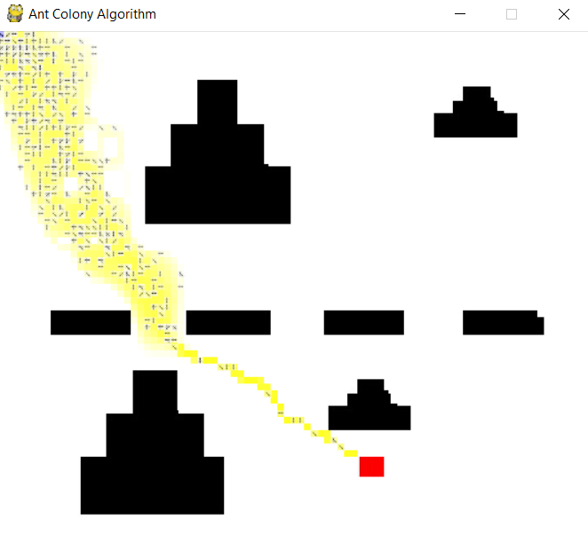
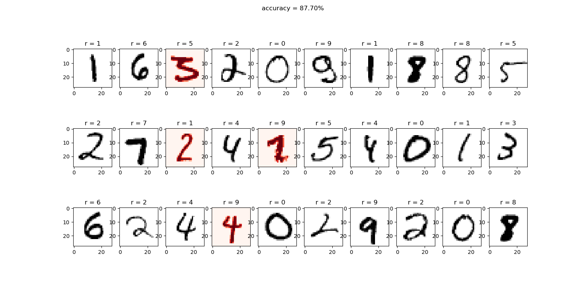
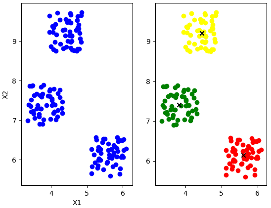
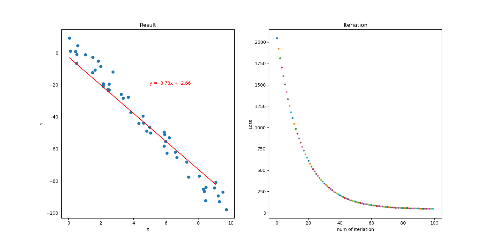

# Programming Project of Advanced AI course 

# [Ant colony algorithm]()

# [Neural network]()
Implemented with numpy - manual designed **forward propegation**, **back propegation**, etc.

Algorithm is based on [marchine learning course](https://www.coursera.org/learn/machine-learning) from Andrew Ng. Tested with the [MNIST](http://yann.lecun.com/exdb/mnist/) database of handwritten digits.

# [K-means]()

# [Linear regression]()

# Installation Dependencies
* Python3
* pygame