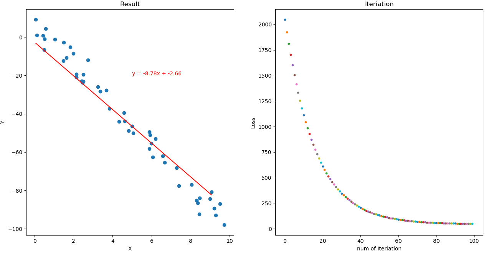

# Programming Project of Advanced AI course 

# [Ant colony algorithm](https://github.com/pangyijiang/Programming-assignments/tree/master/Ant_colony)

# [Neural network](https://github.com/pangyijiang/Programming-assignments/tree/master/Neural_network)
Implemented with numpy - manual designed **forward propegation**, **back propegation**, etc.

Algorithm is based on [marchine learning course](https://www.coursera.org/learn/machine-learning) from Andrew Ng. Tested with the [MNIST](http://yann.lecun.com/exdb/mnist/) database of handwritten digits.

# [K-means](https://github.com/pangyijiang/Programming-assignments/tree/master/K-means)

# [Linear regression](https://github.com/pangyijiang/Programming-assignments/tree/master/Linear_regression)

# Installation Dependencies
* Python3
* pygame